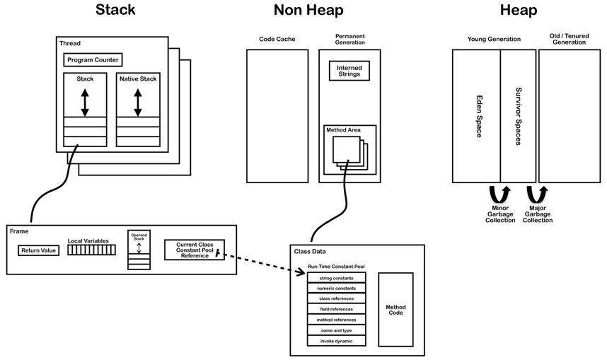
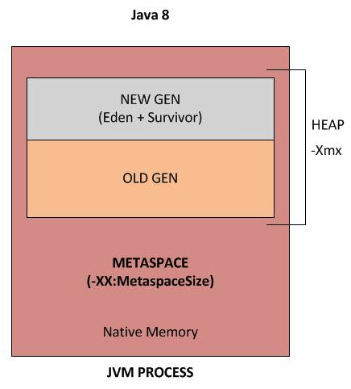

# Java

*Ideally, you should have one mainstream programming language down very well, to use in interviews. Java is mine.*

- [Google Java Style Guide](http://google.github.io/styleguide/javaguide.html)

## Threads

- An interrupt is an indication to a thread that it should stop what it is doing and do something else. It's up to the programmer to decide exactly how a thread responds to an interrupt, but it is very common for the thread to terminate.
- A thread sends an interrupt by invoking `interrupt()` on the `Thread` object for the thread to be interrupted. For the interrupt mechanism to work correctly, the interrupted thread must support its own interruption.
- The `join` method allows one thread to wait for the completion of another. If it is a Thread object that is currently executing, then `thread.join();` causes the current thread to pause execution until its thread terminates.
- When a JVM starts up, there is usually a single non-daemon thread (which typically calls the method named `main` of some designated class). The JVM continues to execute threads until either of the following occurs:
    - The exit method of class `Runtime` has been called and the security manager has permitted the exit operation to take place.
    - All threads that are not daemon threads (`thread.setDaemon(true);` wasn't called) have died, either by returning from the call to the `run` method or by throwing an exception that propagates beyond the `run` method.

## Memory

Type    | bits   | Bytes
--------|--------|-------
boolean | 1 bit  | 1 Byte
byte    | 8 bit  | 1 Byte
short   | 16 bit | 2 Byte
char    | 16 bit | 2 Byte
int     | 32 bit | 4 Byte
float   | 32 bit | 4 Byte
long    | 64 bit | 8 Byte
double  | 64 bit | 8 Byte

- Memory reference (pointer): 4 Bytes.
- Object header: a few Bytes (~8 Bytes) for housekeeping info (GC, class, id, etc.).
- Array header: 12 Bytes (4 Bytes for array length).
- `BitSet` – a bit vector with growing size, each element is a boolean with 1-bit size (not 8-bit as regular booleans).
- Thread stacks are allocated *outside* the heap. The heap only stores objects.
- Thread stacks contain local variables (primitives, heap references) and calls to methods. Sometimes the JVM optimizes and allocates objects that never leave the stack scope on the stack (function-local objects).
- Arrays are like Objects, and are generally stored on the heap.
- Default stack size on 64-bit Linux is 256 KB for a *single thread*.
- Frame size for a simple method call is 32 Bytes.
- [JVM Internals](http://blog.jamesdbloom.com/JVMInternals.html) (read at least until *Class File Structure*.)





- In JDK8 8 PermGen is replaced with Metaspace, which is very similar. The main difference is that Metaspace can expand at runtime (less `java.lang.OutOfMemoryError: PermGen`).
- If you don't specify `MaxMetaspaceSize` the Metaspace will dynamically resize depending on the application demand at runtime.
- Metaspace allocations are out of native memory.
- Metaspace garbage collection of dead classes and classloaders is triggered once the class metadata usage reaches the `MaxMetaspaceSize` option.
- Since JDK 6 interned strings are no longer allocated in the PermGen, but are instead allocated in the regular heap.

## Garbage Collection

- Objects are created on the heap.
- Garbage collection is a mechanism provided by the JVM to reclaim heap space from objects eligible for GC.
- GC is done by the GC thread.
- Before removing an object from memory, GC thread invokes the `finalize()` method of the object, allowing for cleanup operations (but *don't* use finalizers – Effective Java 2nd Ed. Item 7).
- As a developer you can't force GC, it will only be triggered if the JVM thinks it needs to based on the Java heap size.
- You can *request* GC (by `Runtime.gc()` or `System.gc()`) but it's not *guaranteed* to happen.
- If the JVM heap is full, and a new object can't be created, an `OutOfMemoryError` exception is thrown.
- An object becomes eligible for GC if it's not reachable from any live thread of any static reference, meaning if all its references are null.
- Cyclic dependencies aren't references, and they will be GCed if no other objects have a reference to any of them.
- GC scenarios: all references to an object are set to null, object declared in a block and now out of scope, object is a member and the parent is eligible for GC, object in a `WeakHashMap`.
- Java memory leaks:
    - Can be created by some hacks involving `ThreadLocal`, [see link](http://stackoverflow.com/questions/6470651/creating-a-memory-leak-with-java)
    - Static final fields
    - `myString.intern()` – places string in memory pool that can't be removed
    - Unclosed open streams (file, network, etc.) or connections
    - Native hooks that aren't accessible to GC
    - Misuse of JVM options (parameters)
    - `HashSet`/`Map` which uses incorrect `hashCode`, so elements are always added
- [Available garbage collectors](https://docs.oracle.com/javase/8/docs/technotes/guides/vm/gctuning/collectors.html) and how to select one.

## Common JVM Options

- `-Xms1g` – Initial heap size
- `-Xmx2g` – Hax heap size
- `-XX:MaxMetaspaceSize=200m` – Add a limit to Metaspace (not limited by default)
- `-Xmn500m` – Initial *and* max young gen size
- `-XX:SurvivorRatio=4` – Ratio of survivor size relatively to eden size (ratio = young/survivor - 2)
- `-Xss256k` – Thread frame stack size
- [More options](http://blog.sokolenko.me/2014/11/javavm-options-production.html) recommendations and details

## Bit Arithmetics/Operations

- Can use `java.util.BitSet` to work with single bits.
- Positive integers are stored as simple binary numbers:

```java
int a = 0b101;
assertEquals(5, a); // true

int zero  = 0b0;
int one   = 0b1;
int two   = 0b10;
int three = 0b11;
int five  = 0b101;
```

- Negative integers are stored as the two's complement of their absolute value. The two's complement of a positive number is, when using this notation, a negative number.
- To find the negative of a number (`x`) in two's complement:
    - Invert all the bits (`~x`)
    - Add `1` bit (`x + 1`)

```java
int x = 4;
int minusX = ~x + 1;
assertEquals(-4, minusX); // true

int minusOne   = 0b11111111111111111111111111111111;
int minusTwo   = 0b11111111111111111111111111111110;
int minusThree = 0b11111111111111111111111111111101;
int minusFour  = 0b11111111111111111111111111111100;
int minusFive  = 0b11111111111111111111111111111011;
```

- `>>`
    - Signed shift right.
    - Uses the sign bit (left most bit) to fill the trailing positions after the shift.
- `>>>`
    - Unsigned (logical) shift right.
    - Shift right while filling zeros `0`, irrespective of the sign of the number.

## Primitives

- `int` casting drops any decimal, essentially rounding down.

## Strings

- Backed by char array, can get it by calling `toCharArray()`.
- Strings are always immutable, and the class is `final`.
- Strings concatenation with the `+` operator translates to `StringBuilder` operations by the compiler, but creates a new instance of `StringBuilder` for every concatenation. Use `StringBuilder` directly for *repeated* concatenation in multiple statements with intermediate strings (single statements are fine, e.g., for `String s = a + b + c` use `StringBuilder`).

### Interning

- String literals, i.e.`String s = "hello"`, are interned by the compiler.
- Interned strings are privately maintained in a pool, which is initially empty, by the class `String`.
- The `public String intern()` function on `String` places that instance in the pool and returns the canonical representation for that string object.
- When the `intern` method is invoked, if the pool already contains a string equal to this `String` object as determined by the `equals(Object)` method, then the string from the pool is returned.
- Otherwise, this `String` object is added to the pool and a reference to this `String` object is returned.
- All literal strings and string-valued constant expressions are interned.
- `==` tests for reference equality (whether they are the same object).
- `.equals()` tests for value equality (whether they are logically *equal*).
- `new String("test") == "test"` is `false`
- `new String("test") == new String("test")` is `false`
- `"test" == "test"` is `true`
- You almost *always* want to use `.equals()`. In the rare situation where you *know* you're dealing with interned strings, you can use `==`.

## Concurrency

### ITC (Inter-Thread Communication)

- Java includes an inter-process communication mechanism via the `wait()`, `notify()`, and `notifyAll()` methods.
- These methods are implemented as final methods in `Object`, so all classes have them.
- All three methods can be called only from within a `synchronized` method.
- `wait()` tells the calling thread to give up the monitor and go to sleep until some other thread enters the same monitor and calls `notify()`.
- Additional forms of `wait()` exist that allow you to specify a period of time to wait.
- `notify()` wakes up the first thread that called `wait()` on the same object.
- `notifyAll()` wakes up all the threads that called `wait()` on the same object. The highest priority thread will run first.
- You should probably not use `wait`/`notify` directly and use the `Lock` class and others from `java.util.concurrent.locks` instead.

## Access Levels

- Having *no modifier* is also called package-private.
- When a class or interface is accessible to clients for each modifier:

Modifier      | Class | Package | Subclass | World
--------------|-------|---------|----------|-------
`public`      | Yes   | Yes     | Yes      | Yes
`protected`   | Yes   | Yes     | Yes      | No
*no modifier* | Yes   | Yes     | No       | No
`private`     | Yes   | No      | No       | No

## Autoboxing-Unboxing

- *Autoboxing* is the automatic conversion that the Java compiler makes between the primitive types and their corresponding object wrapper classes (e.g., converting an `int` to an `Integer`).
- If the conversion is the other way around (object to primitive) it's *unboxing*.
- The Java compiler applies autoboxing/unboxing when a primitive/object is:
    - Passed as a parameter to a method that expects an object/primitive of the corresponding wrapper/primitive type.
    - Assigned to a variable of the corresponding wrapper/primitive type.
- The compiler uses `valueOf` to autobox and `intValue` to unbox (for `int`, for example).
- Beware of unnecessary Object creation with autoboxing/unboxing.
- Object types don't support operators (`+` for example), so using it on `Integer` will trigger unboxing and then autoboxing.
- For arithmetics always prefer primitives.
- Equality checks with `==` don't unbox and so reference are compares, not values. So to compare two `Integer`s use `.equals()` or preferrable use primitive types.
- You can get `NullPointerException`s when unboxing.
